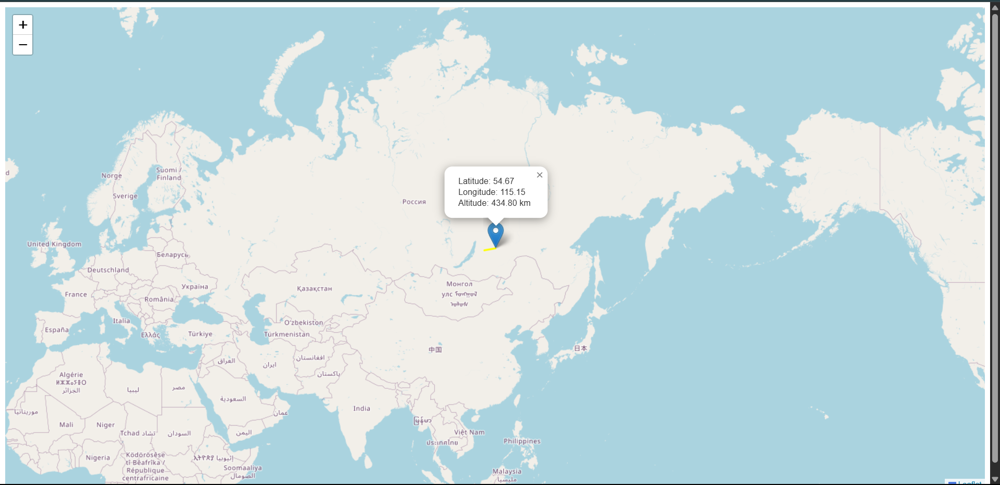

# 🛰️ Live Satellite Tracker

This is a web-based live satellite tracking application that tracks the **live location of a satellite in real time** using data from [N2YO](https://www.n2yo.com/). It displays the satellite's current position on a world map and updates it every 10 seconds.

## 🚀 Features

- 🌍 Real-time satellite position tracking on a world map
- 📈 Trajectory visualization using Leaflet.js
- 🔄 Auto-updates every 10 seconds
- ⚙️ Easily customizable for different satellite NORAD IDs

## 🛠️ Tech Stack

- 🌐 **Flask** as the backend server
- 🗺 **Leaflet.js** for interactive map rendering
- 📡 **N2YO Satellite API** for real-time orbital data
- 🗺️ **OpenStreetMap** for base map tiles

## 📦 Installation

1. **Clone the repository:**

   #bash
   git clone https://github.com/yourusername/live-satellite-tracker.git
   cd live-satellite-tracker

2. **Install dependencies:**

   #bash
   pip install -r requirements.txt

3. **Run the Flask app:**

   #bash
   python app.py

4. **Open in browser:**

   [http://127.0.0.1:5000](http://127.0.0.1:5000)

## 🔧 Configuration

You can customize the following parameters in [app.py](app.py):
   '''#python
   SAT_ID = 63428            # NORAD ID of the satellite
   OBSERVER_LAT = 0          # Observer latitude
   OBSERVER_LNG = 0          # Observer longitude
   OBSERVER_ALT = 0          # Observer altitude in meters
   SECONDS = 1               # Time window (in seconds) for fetching position data

## 🔐 API Key Setup

This app requires a free API key from [Official N2YO API Documentation](https://www.n2yo.com/api/).

 1. Sign up and generate your API key.
 2. Set the environment variable before running:
   #bash
   export N2YO_API_KEY=your_actual_key
 3. In the [app.py](app.py) file, replace:
   #python
   import os
   API_KEY = os.getenv("N2YO_API_KEY")

## 🔮 Live Tracker Preview

   

## License

MIT License. See [LICENSE](LICENSE) for details.

# Acknowledgments

 - [Leaflet.js](https://leafletjs.com/)
 - [OpenStreetMap](https://www.openstreetmap.org/)
 - [N2YO Satellite API](https://www.n2yo.com/api/)
